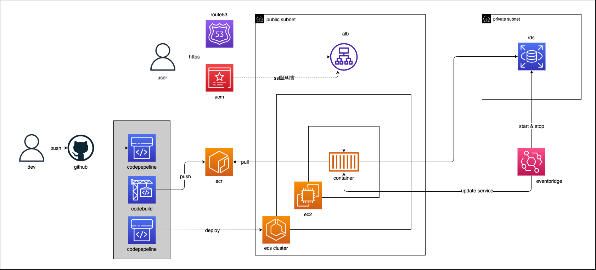

## アプリケーション概要

製造業における部品の入出庫・在庫を管理できるアプリケーション。

フロントエンド: Next.js  
バックエンド: Django REST Framework  
インフラ: aws

認証方法は、JWT 認証を実装しています。

## url

https://zaiko-fe.vercel.app/login

### テスト用アカウント

メールアドレス：normal@test.com  
パスワード：password123

※ aws コストを考慮して、バックエンドは 8-20 時の間のみ稼働

## 作成背景

前職において製造部門があり、その部品管理に課題を感じる。  
具体的には、下記のような課題。

- エクセル等で管理しており、商品名等のデータにばらつきが生じている
- 部品毎の在庫数が算出できていない
- 棚卸表の作成に時間を要している

以上の課題を解決できる機能を考え、アプリケーションを作成しています。

## 技術スタック・開発環境

### [フロントエンド](https://github.com/goayasushi/zaiko-fe)

- Next.js
- Chakra UI
- react icons
- React Hook Form
- axios
- TanStack Query
- jwt-decode

### [バックエンド](https://github.com/goayasushi/zaiko-be)

- Django
- Django REST Framework
- djangorestframework-simplejwt
- django-cors-headers
- psycopg2-binary
- PostgreSQL
- Gunicorn

### インフラ

- フロントエンド: vercel

- バックエンド: AWS
  - Route53
  - ACM
  - ALB
  - ECS on EC2
  - ECR
  - RDS (PostgreSQL)
  - Eventbridge
  - codepipeline
  - codebuild

## CI/CD

### GitHub Actions による自動テスト

master ブランチへのプルリクエスト作成時に、テストのワークフローがトリガーされます。

### CodePipeline / CodeBuild による自動デプロイ

master ブランチへの push をトリガーに、CodeBuild で Docker イメージのビルド・ECR へのプッシュ、ECS on EC2 へのデプロイを実行します。

## aws システム構成図



## ローカル起動

docker 起動を前提として記載

- 環境変数の設定

  .env ファイルを作成し、任意の設定値を記述

  ```
  DATABASE_NAME=データベース名
  DATABASE_USER=ユーザー名
  DATABASE_PASSWORD=ユーザーで接続する際のパスワード
  DATABASE_HOST=ホスト名
  DATABASE_PORT=ポート番号
  ALLOWED_HOSTS=許可するホスト名
  CORS_ALLOWED_ORIGINS=CORS を許可するオリジン
  SECRET_KEY=暗号化や署名に使用される機密鍵
  ```

- 起動

```
docker compose up --build -d
```

## 備忘録

### Amazon ECS の動的ポートマッピング

タスク定義のホストポート, ec2 の sg のエフェメラルポート範囲の設定が必要  
https://repost.aws/knowledge-center/dynamic-port-mapping-ecs  
https://zenn.dev/kazu_o/scraps/7c18bbf7aa4565
